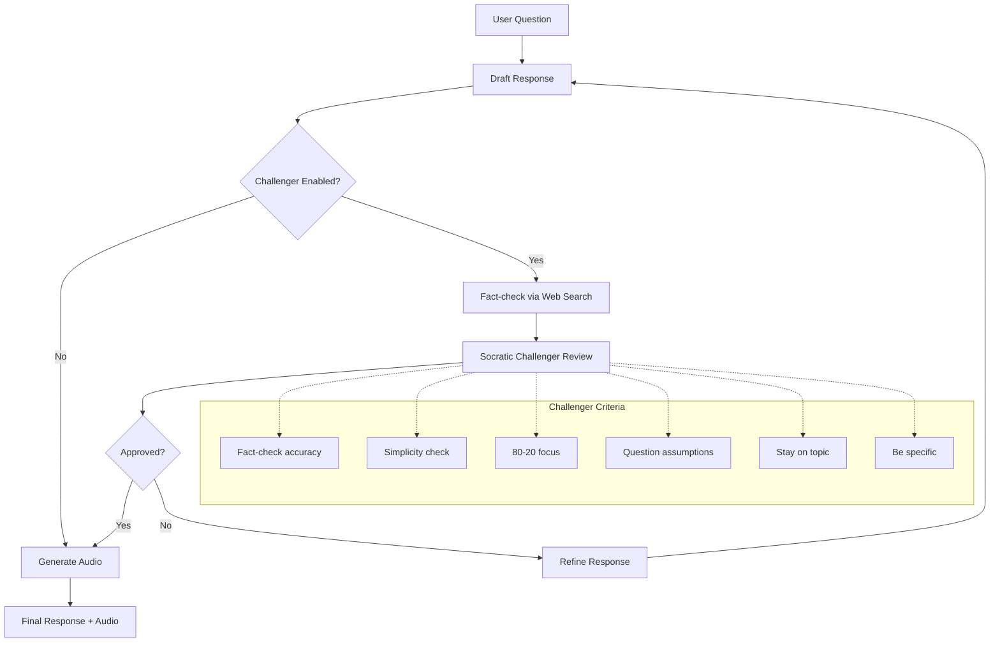

# AI Chat

A local AI chat application with text-to-speech and web search capabilities.

## Features

- **Multiple AI Models**: Switch between DeepSeek, Llama, Qwen, and Mixtral models
- **Voice Output**: Responses are read aloud using natural-sounding voices
- **Web Search**: Ask questions about current events using Brave Search
- **Conversation History**: Your chats are saved locally and can be resumed
- **Socratic Challenger**: Reviews and refines responses for clarity, accuracy, and simplicity

## How It Works

The Socratic Challenger reviews each response against six criteria and can request up to 2 refinements before returning the final answer.

## Quick Start

1. Copy `.env.example` to `.env` and add your API keys
2. Install dependencies: `pip install -e .`
3. Run: `chainlit run app.py`
4. Open http://localhost:8000 in your browser

## Requirements

- Python 3.10+
- [DeepInfra API key](https://deepinfra.com/) for AI models
- [Brave Search API key](https://brave.com/search/api/) (optional, for web search)

## License

MIT
